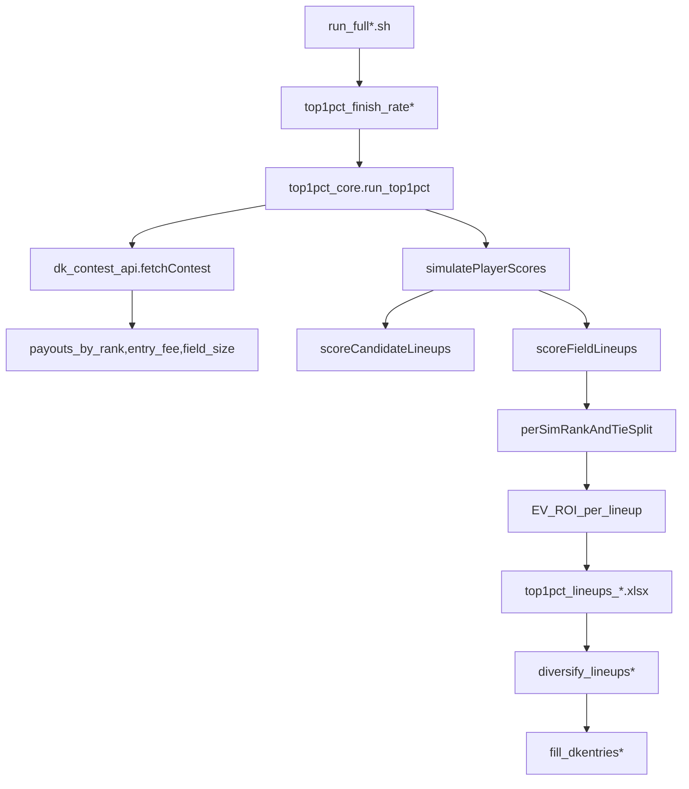

# Add `--contest-id` and EV ROI scoring

### Goals

- Add `--contest-id <id>` support to [`run_full.sh`](/home/john/showdown-optimizer/run_full.sh) and [`run_full_nba.sh`](/home/john/showdown-optimizer/run_full_nba.sh).
- When `--contest-id` is provided:
  - Fetch contest metadata from DraftKings (field size + entry fee + payout tiers).
  - Compute **per-lineup EV ROI**: \(\mathbb{E}[(\text{payout} - \text{entryFee})/\text{entryFee}]\) using DK-style tie-splitting per sim.
  - Write EV ROI into the top1pct workbook and allow diversification to sort by it.

### Non-goals (initial rollout)

- Exact modeling of *your own* multi-entry interaction (e.g., entering 150 lineups simultaneously and cannibalization). We’ll compute EV ROI **per lineup as a single entry vs a simulated field**.
- Authenticated DK endpoints; we’ll use the existing public contest endpoint already used in `flashback_core`.

### Proposed data flow

### Implementation plan

### 1) Add a small shared DK contest API helper (reuse existing flashback logic)

- Create a new shared module, e.g. [`src/shared/dk_contest_api.py`](/home/john/showdown-optimizer/src/shared/dk_contest_api.py).
- Extract/adapt from [`src/shared/flashback_core.py`](/home/john/showdown-optimizer/src/shared/flashback_core.py):
  - The DK URL template: `https://api.draftkings.com/contests/v1/contests/{contest_id}?format=json`
  - Download + cache behavior (write JSON under `data/<sport>/payouts/payouts-{contest_id}.json`).
  - Payout parsing into `payouts_by_rank: np.ndarray` and `entry_fee: float` (existing `_load_payout_structure`).
- Add robust **field size parsing** from `contestDetail` (try multiple keys, e.g. `numEntries`, `entries`, `maxEntries`, etc.). If absent, raise a clear error telling user to pass `--field-size`.
- Public API (suggested):
  - `load_contest_payouts_and_size(contest_id: str, *, data_dir: Path, payouts_json: str|None=None) -> (field_size:int, entry_fee:float, payouts_by_rank:np.ndarray)`

### 2) Extend `top1pct_core.run_top1pct` to compute EV payout + EV ROI

- Update [`src/shared/top1pct_core.py`](/home/john/showdown-optimizer/src/shared/top1pct_core.py):
  - Add optional args: `contest_id: str|None`, `payouts_json: str|None`, `entry_fee_override: float|None`, `field_size_override: int|None`, and **a sim batching knob** (e.g. `sim_batch_size`) to keep memory bounded.
  - Behavior:
    - If `contest_id` is provided and `field_size` was not explicitly provided by caller, fill it from DK contest metadata.
    - If `contest_id` is provided and `field_model == "mixture"`, automatically switch to `field_model="explicit"` (or error with a message) because ROI needs rank vs an explicit field.
    - Load `payouts_by_rank` + `entry_fee` via `dk_contest_api`.
    - Determine `paid_places = count(payouts_by_rank > 0)`.
    - During simulation:
      - Score candidate lineups as today.
      - For explicit-field mode, score field lineups too, **but process sims in batches** so `(batch_size, field_size)` matrices don’t explode.
      - For each sim-row, compute each candidate lineup’s **payout** from its rank among the field’s **top paid** scores (ties handled with DK-style averaging across the tied rank range). This gives a payout per sim per lineup.
      - Average payout across sims → `avg_payout`.
      - Compute `ev_roi = (avg_payout - entry_fee) / entry_fee`.
  - Output workbook changes:
    - In `Lineups_Top1Pct`, append columns:
      - `avg_payout`
      - `ev_roi`
      - `entry_fee`
      - `contest_id`
    - In `Meta`, add the contest fields used (contest_id, derived field_size, paid_places).

### 3) Expose `--contest-id` (and optional overrides) in sport CLIs

- Update:
  - [`src/nfl/top1pct_finish_rate.py`](/home/john/showdown-optimizer/src/nfl/top1pct_finish_rate.py)
  - [`src/nba/top1pct_finish_rate_nba.py`](/home/john/showdown-optimizer/src/nba/top1pct_finish_rate_nba.py)
- CLI changes:
  - Add `--contest-id` (optional).
  - Make `--field-size` optional *only when* `--contest-id` is provided; otherwise keep it required.
  - Add `--payouts-json` (optional) to bypass download/cache.
  - Add `--sim-batch-size` (optional) to control memory.

### 4) Allow diversification to sort by EV ROI

- Update [`src/shared/diversify_core.py`](/home/john/showdown-optimizer/src/shared/diversify_core.py):
  - Add `sort_by` parameter (default `top1_pct_finish_rate` to preserve current behavior).
  - Validate the selected column exists (e.g. `ev_roi` when contest-id is used).
  - Sorting rule: primary `sort_by` desc, then fallback to `top1_pct_finish_rate` desc (when available), then `lineup_projection` desc.
- Update NFL/NBA wrappers:
  - [`src/nfl/diversify_lineups.py`](/home/john/showdown-optimizer/src/nfl/diversify_lineups.py)
  - [`src/nba/diversify_lineups_nba.py`](/home/john/showdown-optimizer/src/nba/diversify_lineups_nba.py)
  - Add CLI flag `--sort-by` with choices `top1_pct_finish_rate` (default) and `ev_roi`.

### 5) Wire `--contest-id` through `run_full*.sh`

- Update [`run_full.sh`](/home/john/showdown-optimizer/run_full.sh) and [`run_full_nba.sh`](/home/john/showdown-optimizer/run_full_nba.sh):
  - Add flag parsing for `--contest-id` while keeping existing positional args working.
  - If `--contest-id` is set:
    - Pass it through to the top1pct step (`python -m ...top1pct_finish_rate... --contest-id ...`).
    - Switch diversification to `--sort-by ev_roi`.
    - Prefer not requiring positional `FIELD_SIZE` (since it’s derived), but allow it as an override.

### 6) Docs and examples

- Update [`README.md`](/home/john/showdown-optimizer/README.md) to document:
  - New `--contest-id` usage in both shell scripts.
  - New top1pct flags and what EV ROI means.
  - Notes on modeling assumption: EV ROI is **single-entry vs simulated field**.

### Testing / validation checklist (lightweight)

- Run a small-size smoke test with `--num-sims 2000` and a small field size to verify:
  - payout JSON download + caching works
  - EV ROI column appears
  - diversification with `--sort-by ev_roi` changes ordering
  - existing runs without `--contest-id` behave identically