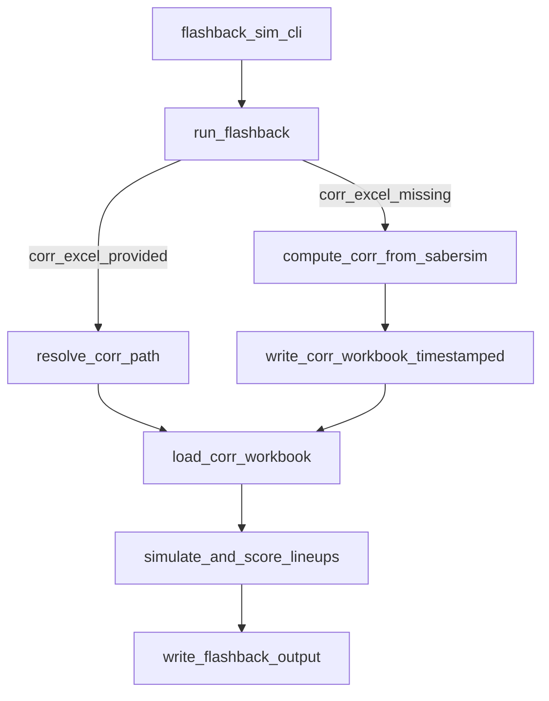

# NFL flashback correlation handling

## Goal

- **NFL flashback** should:
  - **Use a specific correlation workbook** when `--corr-excel` is provided (absolute path or relative to the NFL correlations directory).
  - **Auto-compute correlations from the Sabersim projections** when `--corr-excel` is omitted, using the same approach as the full pipeline (`src/nfl/main.py`), and **write a timestamped correlations workbook** into `outputs/nfl/correlations/`.

## Current state (what’s happening today)

- `run_flashback()` in [`src/shared/flashback_core.py`](/home/john/showdown-optimizer/src/shared/flashback_core.py) always resolves a correlation workbook path (latest `.xlsx` in a directory if `corr_excel` is `None`) and loads correlations from that workbook.
- The “full pipeline” correlation build already exists in [`src/nfl/main.py`](/home/john/showdown-optimizer/src/nfl/main.py): load Sabersim → `simulate_corr_matrix_from_projections()` → write workbook with `Sabersim_Projections` and `Correlation_Matrix` sheets.

## Proposed behavior & flow

## Implementation plan

### 1) Make correlation workbook selection deterministic and sport-aware (NFL-only change)

- Update [`src/shared/flashback_core.py`](/home/john/showdown-optimizer/src/shared/flashback_core.py) to replace the unconditional `_resolve_latest_excel(corr_dir, corr_excel)` behavior with:
  - **If `corr_excel` is provided**:
    - Treat it as an explicit file path.
    - If it’s **relative**, resolve it **relative to `config_module.CORRELATIONS_DIR`** (already set for NFL to `outputs/nfl/correlations`).
    - Validate file exists; raise a clear error message showing the resolved path.
  - **If `corr_excel` is not provided**:
    - Compute correlations from Sabersim projections (see next section).

### 2) Compute correlations from Sabersim projections when workbook isn’t provided

- In [`src/shared/flashback_core.py`](/home/john/showdown-optimizer/src/shared/flashback_core.py), add a helper like `_build_corr_workbook_from_sabersim(...)` that:
  - Loads FLEX-only Sabersim projections using the already-injected `load_sabersim_projections(sabersim_path)`.
  - Calls the already-injected `simulate_corr_matrix_from_projections(sabersim_df)` (NFL wrapper passes `src/nfl/simulation_corr.simulate_corr_matrix_from_projections`).
  - Writes a workbook to `config_module.CORRELATIONS_DIR` (NFL: `outputs/nfl/correlations/`) with:
    - Sheet `Sabersim_Projections` (same schema used elsewhere)
    - Sheet `Correlation_Matrix`
  - Uses a filename like `flashback_corr_{contest_id}_{YYYYMMDD_HHMMSS}.xlsx`.
  - Returns the written workbook `Path` so the rest of the pipeline can reuse the existing `_load_corr_workbook()` path.

### 3) Update NFL flashback CLI help + docs

- Update [`src/nfl/flashback_sim.py`](/home/john/showdown-optimizer/src/nfl/flashback_sim.py):
  - `--corr-excel` help should say:
    - accepts an explicit path (absolute or relative to `outputs/nfl/correlations/`)
    - if omitted, correlations are computed from the Sabersim projections and a workbook is written under `outputs/nfl/correlations/`.
- Update the relevant README section (likely around your flashback CLI docs) to reflect the new behavior and show examples.

### 4) Add lightweight tests for the new behavior

- Add a focused test file under [`tests/`](/home/john/showdown-optimizer/tests) (or extend an existing one) that:
  - Mocks `simulate_corr_matrix_from_projections` to return a tiny deterministic correlation matrix quickly.
  - Uses a temporary directory as `config_module.CORRELATIONS_DIR`.
  - Verifies:
    - When `corr_excel=None`, a workbook is written and then loaded.
    - When `corr_excel` is a relative filename, it resolves against `CORRELATIONS_DIR`.
    - When `corr_excel` points to a missing file, the error message is clear.

## CLI usage after change (NFL)

- Explicit correlation workbook (absolute or relative):
  - `python -m src.nfl.flashback_sim --corr-excel my_corr.xlsx ...` (resolved under `outputs/nfl/correlations/my_corr.xlsx`)
  - `python -m src.nfl.flashback_sim --corr-excel /abs/path/to/corr.xlsx ...`
- Auto-compute correlations:
  - `python -m src.nfl.flashback_sim --sabersim-csv ... --contest-csv ...` (no `--corr-excel`)

## Files to change

- [`src/shared/flashback_core.py`](/home/john/showdown-optimizer/src/shared/flashback_core.py)
- [`src/nfl/flashback_sim.py`](/home/john/showdown-optimizer/src/nfl/flashback_sim.py)
- [`README.md`](/home/john/showdown-optimizer/README.md)
- New/updated tests under [`tests/`](/home/john/showdown-optimizer/tests)