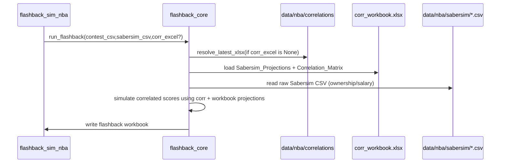

# Flashback correlation workbook default

## Desired behavior

- **NBA flashback (`python -m src.nba.flashback_sim_nba`) loads correlations from a workbook by default**, using the most recent `*.xlsx` found in `data/nba/correlations/`.
- Flashback **fails fast** with a clear error if it cannot find/load that workbook (unless the user explicitly passes an override later).
- When using a correlation workbook, flashback **uses the workbook’s `Sabersim_Projections` sheet for projections (mu/sigma)** and **`Correlation_Matrix` sheet for correlations**, keeping them consistent.
- Flashback still uses `--sabersim-csv` (or latest in `data/nba/sabersim/`) to read **raw Sabersim rows for ownership/salary columns** in the output workbook.

## Implementation steps

### 1) Extend flashback core to accept/load a correlation workbook

- Update the signature of `run_flashback()` in [`/home/john/showdown-optimizer/src/shared/flashback_core.py`](/home/john/showdown-optimizer/src/shared/flashback_core.py) to accept a new optional arg, e.g. `corr_excel: str | None`.
- Add a helper in `flashback_core.py` similar to `_resolve_latest_csv()` but for Excel:
  - Resolve `corr_path` from an explicit `corr_excel` if provided.
  - Otherwise resolve the most recent `*.xlsx` in `config_module.DATA_DIR / "correlations"`.
  - If no file exists, raise `FileNotFoundError` with a message like: `No correlation workbook found in data/nba/correlations/. Generate one or pass --corr-excel`.
- Load the workbook via the existing shared loader in [`/home/john/showdown-optimizer/src/shared/top1pct_core.py`](/home/john/showdown-optimizer/src/shared/top1pct_core.py):
  - Use `top1pct_core._load_corr_workbook(corr_path)` to obtain `sabersim_proj_df` and `corr_df` (expects sheets `Sabersim_Projections` and `Correlation_Matrix`).
- Replace the current “simulate corr from projections” branch in `run_flashback()`:
  - **Delete/skip** `print("Building player correlation matrix via simulation...")` and the call to `simulate_corr_matrix_from_projections()` when a workbook is used.
  - Use `sabersim_proj_df` (workbook projections) as the projections dataframe for `_build_player_universe_from_sabersim_and_lineups(...)`.
- Keep reading `sabersim_raw_df = pd.read_csv(sabersim_path)` for ownership/salary calculations (unchanged).

### 2) Add CLI plumbing: `--corr-excel`

- In [`/home/john/showdown-optimizer/src/nba/flashback_sim_nba.py`](/home/john/showdown-optimizer/src/nba/flashback_sim_nba.py):
  - Add `corr_excel: str | None = None` to `run()` and pass it through to `flashback_core.run_flashback(corr_excel=corr_excel, ...)`.
  - Add an argparse flag `--corr-excel` (optional) explaining:
    - default is latest `data/nba/correlations/*.xlsx`
    - must contain `Sabersim_Projections` and `Correlation_Matrix` sheets.
- Mirror the same change for NFL for consistency in [`/home/john/showdown-optimizer/src/nfl/flashback_sim.py`](/home/john/showdown-optimizer/src/nfl/flashback_sim.py), defaulting to latest `data/nfl/correlations/*.xlsx`.

### 3) Update documentation

- Update the NBA flashback README section around your cursor location in [`/home/john/showdown-optimizer/README.md`](/home/john/showdown-optimizer/README.md) to document:
  - the new default correlation source (`data/nba/correlations/`)
  - how to override with `--corr-excel`
  - the “fail fast if missing/unreadable” behavior
  - a short example invocation.

### 4) Quick validation checklist (manual)

- Run NBA flashback with only `--contest-csv` and `--sabersim-csv` omitted to ensure it:
  - resolves latest contest + latest sabersim + latest correlation workbook
  - errors clearly if correlation workbook is missing
  - no longer prints “Building player correlation matrix via simulation...”
- Run with `--corr-excel <explicit>` to ensure the override works.

## Data flow (after change)

