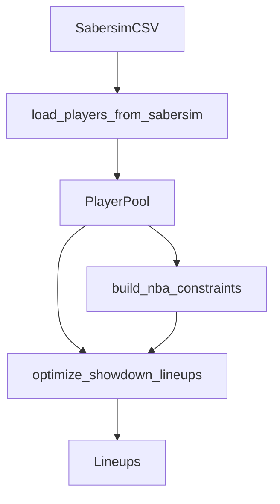

# NBA Showdown hard constraints

## Goals

- **Hard-enforce** (no CLI flags needed) the following for NBA Showdown optimization:
  - **CPT projected minutes \(\ge 24\)**
  - **Max 1 UTIL/FLEX player with projection \(\le 8\)** (does **not** count CPT)
  - **Minimum lineup salary \(\ge 48,500\)** (with CPT salary using existing 1.5× rounding)

## Key design decisions

- **NBA-only enforcement**: Implement as NBA-only `ConstraintBuilder`s and attach them in the NBA CLI (`src/nba/showdown_optimizer_main.py`). NFL remains unchanged.
- **Minutes support**: Extend the shared `Player` model with an **optional projected minutes** field and teach the shared Sabersim loader to read the NBA CSV’s `Min` column.
  - The NBA Sabersim files already include `Min` (example header includes `...,PTS,Min,2PT,...`).

## Implementation steps

### 1) Add projected minutes to the shared player model

- Update [` `/home/john/showdown-optimizer/src/shared/optimizer_core.py` `](/home/john/showdown-optimizer/src/shared/optimizer_core.py):
  - Add `proj_min: float | None = None` (or similarly named) to `@dataclass(frozen=True) class Player`.
  - Keep default `None` so NFL runs don’t require minutes.

### 2) Parse minutes from Sabersim CSVs when available

- Update [` `/home/john/showdown-optimizer/src/shared/lineup_optimizer.py` `](/home/john/showdown-optimizer/src/shared/lineup_optimizer.py):
  - Add constant `SABERSIM_MIN_COL = "Min"`.
  - In `load_players_from_sabersim`, if `Min` exists and is non-null, set `proj_min=float(row["Min"])`; else `None`.
  - No other schema changes required.

### 3) Implement NBA-only constraint builders

- Add a new module, e.g. [` `/home/john/showdown-optimizer/src/nba/showdown_constraints.py` `](/home/john/showdown-optimizer/src/nba/showdown_constraints.py) (name can vary), containing:
  - `cpt_min_minutes(min_minutes: float = 24) -> ConstraintBuilder`
    - For each player with `proj_min` present and `< 24`, force `x[(pid, "CPT")] == 0`.
  - `max_low_proj_utils(max_count: int = 1, threshold: float = 8) -> ConstraintBuilder`
    - Define `low = {p | p.dk_proj <= 8}` and enforce:
      - `sum_{p in low, slot in FLEX_SLOTS} x[(p, slot)] <= 1`
  - `min_lineup_salary(min_salary: int = 48_500) -> ConstraintBuilder`
    - Use the same salary expression as the cap constraint:
      - `sum_p p.cpt_salary*x[(p,CPT)] + sum_{p,slot in FLEX_SLOTS} p.dk_salary*x[(p,slot)] >= 48500`
  - `build_nba_constraints() -> list[ConstraintBuilder]` returning all three.

### 4) Wire constraints into NBA optimizer entry point

- Update [` `/home/john/showdown-optimizer/src/nba/showdown_optimizer_main.py` `](/home/john/showdown-optimizer/src/nba/showdown_optimizer_main.py):
  - Import `build_nba_constraints()`.
  - Replace `base_constraint_builders: list = []` with `base_constraint_builders = build_nba_constraints()`.
  - Ensure multi-stack mode continues to append stack constraints on top of these base constraints.

### 5) Add focused tests (solver-level)

- Add a small test file (e.g. [` `/home/john/showdown-optimizer/tests/test_nba_hard_constraints.py` `](/home/john/showdown-optimizer/tests/test_nba_hard_constraints.py) or similar) that:
  - Constructs a tiny `PlayerPool` with known projections/salaries/minutes.
  - Verifies:
    - A <24-minute player is never selected as CPT.
    - Two low-proj UTILs cannot both appear in the FLEX slots.
    - Solutions returned satisfy salary \(\ge 48500\), and if the pool cannot reach it the solver yields infeasible/None appropriately.

## Quick dataflow (where constraints apply)

## Files expected to change

- [` `/home/john/showdown-optimizer/src/shared/optimizer_core.py` `](/home/john/showdown-optimizer/src/shared/optimizer_core.py)
- [` `/home/john/showdown-optimizer/src/shared/lineup_optimizer.py` `](/home/john/showdown-optimizer/src/shared/lineup_optimizer.py)
- [` `/home/john/showdown-optimizer/src/nba/showdown_optimizer_main.py` `](/home/john/showdown-optimizer/src/nba/showdown_optimizer_main.py)
- **Add** [` `/home/john/showdown-optimizer/src/nba/showdown_constraints.py` `](/home/john/showdown-optimizer/src/nba/showdown_constraints.py) (or similarly named)
- **Add** a small tests file under `/home/john/showdown-optimizer/tests/` (or repository test location you prefer)

## Acceptance criteria

- NBA optimizer-generated lineups always satisfy:
  - CPT player has `Min \(\ge 24\)`
  - At most 1 UTIL with `My Proj \(\le 8\)`
  - Lineup salary \(\ge 48,500\) and \(\le 50,000\) (existing cap)
- NFL optimizer behavior is unchanged.