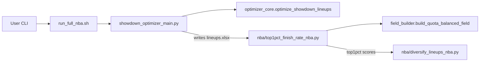

# Incremental plan to speed up NBA Showdown lineup generation

## High-level approach

- **Goal**: Reduce wall-clock time to generate large NBA Showdown lineup sets (e.g., 2,000+ lineups) while preserving lineup quality, by implementing improvements in this order:

1) Parallelization, 2) model reuse/warm starts, 3) relaxed optimality, 4) augmentation with field-style lineups.

- **Strategy**: Add light-weight profiling first, then implement each optimization behind flags/CLI options so you can A/B test against your current behavior.
- **Key codepaths**:
  - Optimizer CLI: [`src/nba/showdown_optimizer_main.py`](/home/john/showdown-optimizer/src/nba/showdown_optimizer_main.py)
  - Shared MILP core: [`src/shared/optimizer_core.py`](/home/john/showdown-optimizer/src/shared/optimizer_core.py)
  - Shared lineup adaptor: [`src/shared/lineup_optimizer.py`](/home/john/showdown-optimizer/src/shared/lineup_optimizer.py)
  - Field builder / top1% core: [`src/shared/field_builder.py`](/home/john/showdown-optimizer/src/shared/field_builder.py), [`src/shared/top1pct_core.py`](/home/john/showdown-optimizer/src/shared/top1pct_core.py)
  - NBA top1% wrapper and pipeline: [`src/nba/top1pct_finish_rate_nba.py`](/home/john/showdown-optimizer/src/nba/top1pct_finish_rate_nba.py), [`run_full_nba.sh`](/home/john/showdown-optimizer/run_full_nba.sh).

## Step 0: Add profiling scaffolding and establish a baseline

- **Add a simple timing/metrics helper**
  - Create a tiny helper (either inline or as `src/shared/profiling.py`) that exposes functions like `start_timer(label)` / `end_timer(label)` or a context manager (e.g., `time_block("optimize")`) that logs elapsed seconds.
  - In [`src/nba/showdown_optimizer_main.py`](/home/john/showdown-optimizer/src/nba/showdown_optimizer_main.py), augment existing timing code around the call to `optimize_showdown_lineups` to:
    - Print a short, machine-parsable line (e.g., `OPT_TIME seconds=X num_lineups=Y stack_mode=multi chunk_size=50`).
    - Optionally write a JSON metrics file alongside the lineups workbook (e.g., `lineups_..._metrics.json`) containing wall-clock optimization time, num_lineups, stack_mode, chunk_size, and maybe per-pattern counts.
  - Leave profiling off by default or always-on but cheap; no behavioral changes to optimization logic.
- **Baseline procedure**
  - Define a standard test command for a big slate (e.g., 2,000 lineups, `--stack-mode multi`) and record baseline times with your current code.
  - These baselines will be the reference when you flip on later flags.

## Step 1: Parallelization (low-complexity, focused on multi-stack mode)

- **1.1 Add CLI flags to control parallelism**
  - In `showdown_optimizer_main.py`, add flags like:
    - `--num-workers` (int, default 1) to control process-level parallelism.
    - `--parallel-mode` with choices like `none|by_stack_pattern` (default `none` to keep current behavior).
  - Ensure `run_full_nba.sh` can optionally pass `--num-workers` and `--parallel-mode by_stack_pattern` (add them in the `python -m src.nba.showdown_optimizer_main` call when desired).

- **1.2 Parallelize across stack patterns in multi-stack mode**
  - Today, in multi-stack mode, you loop over `STACK_PATTERNS` sequentially and call `optimize_showdown_lineups` for each.
  - Refactor this section of `main()` to:
    - Build a small description object per pattern: `{pattern, n, constraint_builders_for_pattern}`.
    - If `stack_mode == "multi" and parallel_mode == "by_stack_pattern" and num_workers > 1`:
      - Use `concurrent.futures.ProcessPoolExecutor(max_workers=num_workers)` to submit one task per pattern that calls a small helper function (module-level, pickleable) that runs `optimize_showdown_lineups` for that pattern and returns its lineups + label.
      - Collect results, merge lineups/labels, and reuse the existing de-duplication logic.
    - If `num_workers == 1` or `parallel_mode == "none"`, keep the existing sequential behavior.
  - Carefully preserve deterministic ordering where you care about it (e.g., sort patterns by a fixed order before launching futures, or sort final results by projection after merging).

- **1.3 (Optional) Parallelize non-multi-stack large runs later**
  - For `--stack-mode none`, you *can* split `args.num_lineups` into equal chunks and solve each chunk in a separate process, each calling `optimize_showdown_lineups` with its own `num_lineups` and then merging/deduping.
  - Keep this as a follow-up only if you find that `stack-mode none` runs are also a severe bottleneck; initial implementation can focus on the multi-stack path you mostly use.

- **1.4 Extend profiling to parallel mode**
  - When `parallel_mode` is active, capture and log:
    - Total optimization wall-clock time.
    - Per-pattern times (each worker can log to its own metrics dict that you aggregate, or simply measure around each future in the parent process).
  - Confirm speedup vs. baseline using the same slate/command as Step 0.

## Step 2: Improve model reuse / warm-start behavior

- **2.1 Expose chunking & reuse behavior more explicitly at the CLI**
  - You already have `--chunk-size` in `showdown_optimizer_main.py`, and `optimizer_core.optimize_showdown_lineups` has:
    - A **single-model** path when `chunk_size <= 0`.
    - A **rebuild-per-chunk** path when `chunk_size > 0`.
  - Add documentation and CLI help text clarifying that:
    - `chunk_size <= 0` means “reuse a single growing model (with no-dup constraints) for all lineups”.
    - `chunk_size > 0` uses fresh models per chunk and is often more robust but has more model-build overhead.
  - Optionally default `--chunk-size` differently for large `--num-lineups` (e.g., a heuristic: if `num_lineups > 1000` and stack_mode == multi, set a slightly larger chunk size) – but keep current behavior as default initially and push any heuristic changing of defaults to *after* measurement.

- **2.2 Add optional warm-starting to the single-model path**
  - In [`src/shared/optimizer_core.py`](/home/john/showdown-optimizer/src/shared/optimizer_core.py), inside the non-chunk path of `optimize_showdown_lineups`:
    - Change the solver construction to opt into CBC warm starts when supported, e.g., `pulp.PULP_CBC_CMD(msg=False, warmStart=True)`.
    - Optionally add a parameter `use_warm_start: bool = False` to `optimize_showdown_lineups` that toggles this (plumbed from `showdown_optimizer_main.py` via a new CLI flag like `--use-warm-start`).
  - Because you are already reusing the same `prob` and `x` and just adding constraints between iterations, warm starts allow CBC to reuse previous basis/solution information across solves, which can reduce time per additional lineup.

- **2.3 Evaluate "single growing model" vs. chunked model for your use case**
  - Using your profiling scaffolding, run:
    - Current chunked behavior (e.g., `--chunk-size 50`).
    - Single-model behavior with `--chunk-size 0` and `--use-warm-start` both on and off.
  - Compare:
    - Total time, and time per lineup.
    - Number of lineups actually produced (to ensure feasibility isn’t an issue).
  - Decide on a recommended configuration for your normal large-slate runs (could remain chunked, or switch to single-model+warm-start for multi-stack patterns).

## Step 3: Relax how perfect each optimization must be (MIP gap / time limits)

- **3.1 Add solver tolerance/time-limit knobs in the MILP core**
  - In `optimizer_core.optimize_showdown_lineups`, extend the function signature to accept:
    - `max_seconds: float | None = None` for a per-solve time limit.
    - `rel_gap: float | None = None` for a relative optimality gap (if supported by CBC via PuLP; otherwise consider approximate proxies like absolute gap or early-stop callbacks).
  - Pass these into `pulp.PULP_CBC_CMD` (e.g., `timeLimit` / `gapRel` / appropriate arguments per PuLP/CBC version) so CBC will stop when either time is exceeded or the gap is small enough.
  - Ensure the function still returns the best incumbent lineup found, even if status is not strictly “Optimal” (e.g., treat “Not Solved” with an incumbent as acceptable; you may need to inspect status codes and handle them carefully).

- **3.2 Surface these knobs at the NBA optimizer CLI**
  - In `showdown_optimizer_main.py`, add CLI flags like:
    - `--solver-max-seconds` (float, per-solve or per-chunk limit; start with something small like 1–2 seconds as a default for experiments but leave default None for backwards compatibility).
    - `--solver-rel-gap` (float, e.g., 0.005 for 0.5% relative gap).
  - Forward them into `optimize_showdown_lineups` for both single-model and chunked paths.

- **3.3 Measure tradeoffs and pick practical defaults**
  - With profiling on, run your large-slate tests with different tolerances:
    - Baseline: no time limit, exact optimal.
    - `rel_gap=0.5%`, `max_seconds=2`, etc.
  - For each configuration log:
    - Total time and time per lineup.
    - Round-level metrics (e.g., average projection of lineups vs. baseline to ensure you aren’t losing too much quality).
  - Choose a “fast but safe” default (e.g., a small positive gap and moderate time limit) and potentially bake that into `run_full_nba.sh` or your personal alias, while keeping full-optimality mode still available via CLI.

## Step 4: Augment optimized lineups with field-style lineups and grade all via top 1%

- **4.1 Decide on the augmentation interface**
  - Keep the existing pipeline in [`run_full_nba.sh`](/home/john/showdown-optimizer/run_full_nba.sh):
    - Step 1: generate `lineups_*.xlsx` from the optimizer.
    - Step 2: run `top1pct_finish_rate_nba`.
    - Step 3: diversify.
  - Plan to *insert* an optional “augmentation” step between Step 1 and Step 2 that:
    - Reads the optimizer lineups workbook.
    - Uses existing projections/ownership/correlation data to generate a set of quota-balanced field-style lineups via `field_builder.build_quota_balanced_field`.
    - Appends these additional lineups as new rows in the `Lineups` sheet (tagging them as `source="field"` vs. `source="opt"` in an auxiliary column, or encoding via stack pattern labels).
    - Writes out a new, augmented lineups workbook for top1% scoring.

- **4.2 Implement an NBA-specific augmentation script**
  - Add a new CLI module, e.g. [`src/nba/augment_lineups_with_field.py`](/home/john/showdown-optimizer/src/nba/augment_lineups_with_field.py), that:
    - Accepts arguments:
      - `--lineups-excel` (input from optimizer).
      - `--corr-excel` (existing correlations workbook).
      - `--extra-lineups` (number of additional field-style lineups to generate).
      - `--output-excel` (augmented workbook path; default to a new file in the same run dir).
    - Loads:
      - The lineups, ownership, and projections sheets via `top1pct_core._load_lineups_workbook`-like helpers or reimplemented minimal logic.
      - The correlation workbook via `top1pct_core._load_corr_workbook`.
    - Uses `build_quota_balanced_field(field_size=extra_lineups, ...)` to generate a DataFrame of CPT+5 FLEX lineups.
    - Maps these into the same `Lineups` schema as the optimizer output (cpt, util1–util5 / flex1–flex5, rank, etc.), assigning:
      - A new rank range after existing optimizer lineups.
      - A `stack` or `target_stack_pattern` label that indicates these came from the field builder, if desired.
    - Concatenates optimizer + field-style lineups, writes out the augmented workbook.

- **4.3 Wire augmentation into the full pipeline and profile**
  - In `run_full_nba.sh`, insert an optional step between Step 1 and Step 2:
    - Controlled by new env vars or CLI parameters (e.g., `EXTRA_FIELD_LINEUPS`), defaulting to 0 (no augmentation).
    - When `EXTRA_FIELD_LINEUPS > 0`, call `python -m src.nba.augment_lineups_with_field ...` to create a new lineups workbook and pass that path into `top1pct_finish_rate_nba` instead of the original optimizer-only workbook.
  - Use your profiling scaffolding to measure:
    - Additional time spent in augmentation and top1% scoring.
    - Impact on diversification and final top1% distributions.

- **4.4 Iterate on field-style lineup hyperparameters (optional)**
  - If beneficial, expose a few `FieldBuilderConfig` knobs (e.g., alpha/beta/gamma/delta, min_salary) via the augmentation script’s CLI to experiment with more aggressive or more contrarian field-like candidates.
  - Keep defaults aligned with your current field-model assumptions unless experimentation shows a clear EV gain.

## Step 5: Compare configurations and settle on a “fast default”

- After each step, use the same test slate and command structure to compare:
  - Total runtime, runtime per lineup, and per-step contributions.
  - Lineup quality (projection, ownership leverage, and especially top1% scores).
- Once you’re satisfied, bake your preferred flags (`--num-workers`, `--chunk-size`, `--use-warm-start`, solver tolerances, and optional augmentation) into your typical `run_full_nba.sh` invocation or your own wrapper script so your day-to-day workflow uses the optimized configuration by default.